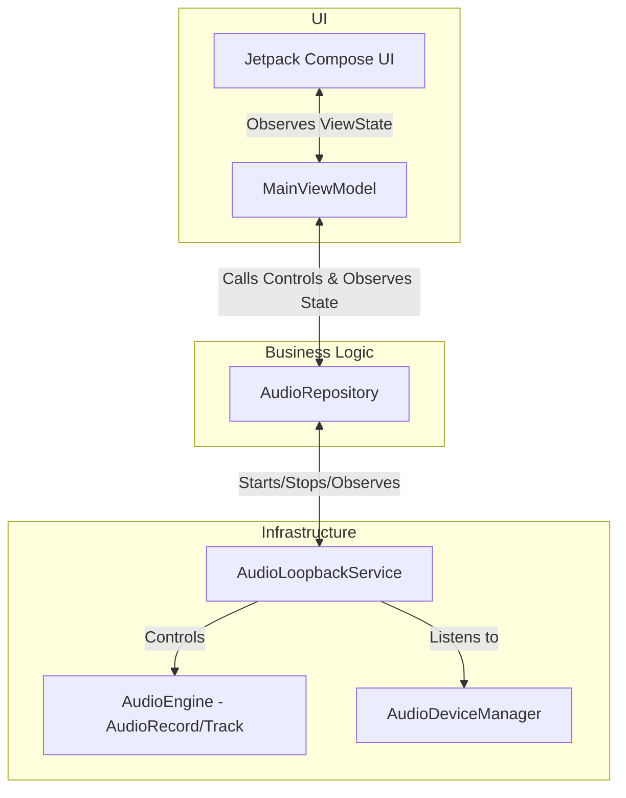

# re:speak — Architecture Design Document

This document defines the strict architectural patterns and package structure for the **re:speak** application. The project is built using a modified **Clean Architecture + MVVM (Model-View-ViewModel)** design, optimized for an app that coordinates a persistent background system service.

---

## 1. Architectural Diagram

To decouple the UI from background audio lifecycle limitations, an **AudioRepository** acts as the single source of truth. Both the UI (ViewModel) and the Service communicate through this repository.



---

## 2. Directory & Package Layout

The project package (`com.respeak.app`) will be strictly structured into the following layers:

```
com.respeak.app/
│
├── data/                             # Infrastructure & Audio Implementation
│   ├── audio/
│   │   ├── AudioDeviceManager.kt     # Monitors output routing (Headphones/BT)
│   │   └── AudioEngine.kt            # Wraps AudioRecord & AudioTrack PCM loop
│   │
│   ├── repository/
│   │   └── AudioRepositoryImpl.kt    # Implements domain interface, communicates with Service
│   │
│   └── service/
│       └── AudioLoopbackService.kt   # Android Foreground Service (MediaPlayback)
│
├── domain/                           # Pure business logic (No Android dependencies)
│   ├── model/
│   │   ├── LoopbackState.kt          # Active, Idle, Warning, Interrupted states
│   │   └── AudioDeviceType.kt        # Safe vs. Unsafe output devices
│   │
│   └── repository/
│       └── AudioRepository.kt        # Repository Interface
│
├── ui/                               # Presentation Layer
│   ├── theme/
│   │   ├── Color.kt                  # Light/Dark theme color tokens
│   │   ├── Theme.kt
│   │   └── Type.kt
│   │
│   ├── main/
│   │   ├── MainActivity.kt           # Renders Jetpack Compose layout
│   │   ├── MainViewModel.kt          # Manages UI-specific states & timer logic
│   │   └── components/               # Small Compose components (Pulsing ring, warnings)
│   │       ├── PlayPauseButton.kt
│   │       ├── AudioWaveform.kt
│   │       └── WarningCard.kt
│   │
│   └── onboarding/
│       └── OnboardingScreen.kt       # Onboarding Compose components
```

---

## 3. Core Architectural Rules

To ensure a highly maintainable and clean project, we must enforce the following constraints:

### Rule 1: Separation of Audio Lifecycle
- The `AudioEngine` and `AudioLoopbackService` are independent of the UI.
- The UI (Compose/Activity) can be killed by the system at any time (e.g., due to background memory constraints), but the audio loopback must continue running through the Foreground Service.
- The `AudioRepository` handles this by binding to the service or exposing global `StateFlow` streams.

### Rule 2: Unidirectional Data Flow (UDF)
1. **Events Flow Up:** The UI triggers events (e.g., `OnPlayTapped`, `OnPauseTapped`) on the `MainViewModel`.
2. **Commands Flow Down:** The ViewModel forwards these commands to the `AudioRepository`.
3. **State Flows Up:** The `AudioRepository` updates the active state (`LoopbackState`). The ViewModel transforms this into UI state, which the Compose functions collect to dynamically update the screen.

### Rule 3: No Android context leaks
- The `ViewModel` and Domain models must never reference the Activity/Service context directly, ensuring unit testability.
- Any Android framework actions (like requesting system settings or starting the service) will be handled through application-context-safe Repository classes or delegated via events.
