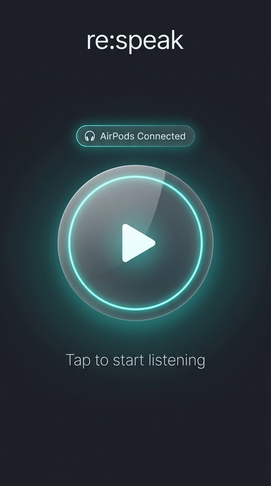
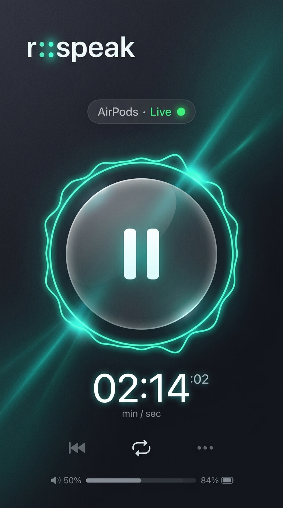
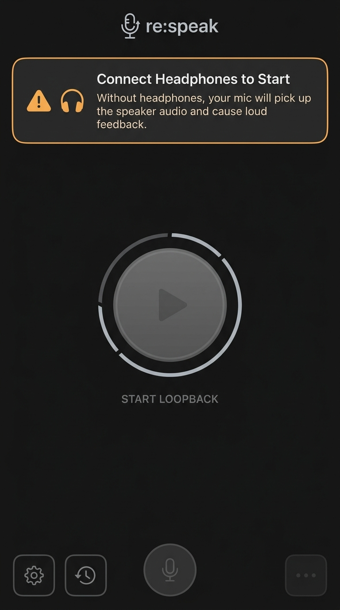

# re:speak — Designer Brief

This document serves as the visual specification for the designers of the **re:speak** application.

---

## 1. Logo & Identity
The identity of re:speak is built around simplicity and functional minimalism. 

* **Signature Concept:** The colon `:` in **re:speak** is the brand's signature element.
* **Concepts to Explore:**
  1. A colon representing a soundwave.
  2. The two dots of the colon acting as a speaker and an ear (input and output).
  3. A colon transitioning into a live audio pulse.
* **Required Logo Assets:**
  - **Adaptive Icon (Android):** Foreground layer (108x108dp) + Background layer with a 66dp safe zone.
  - **Legacy Icons:** All densities (mdpi 48px, hdpi 72px, xhdpi 96px, xxhdpi 144px, xxxhdpi 192px).
  - **Play Store Icon:** 512x512px PNG format.
  - **Themed Icon:** Monochrome variant compatible with Android 13+ themed home screens.
  - **Notification Silhouette:** A flat white icon (24x24dp) with transparent background. Android forces notification icons to be pure white silhouette on transparent background.
  - **Wordmark:** Scalable Vector Graphic (SVG) for the Splash/About screen.

---

## 2. Typography & Color Systems

### Color Palettes
The app must support both **Light Mode** and **Dark Mode** via `values-night` configurations. The colors should look premium and clean.

* **Option A: Calm Therapy (Recommended & Implemented)**
  - *Light Mode:* Soft grey background, soothing slate/blue text, and a calming teal/cyan active highlight.
  - *Dark Mode (Premium Visuals):*
    - **Background:** Vertical linear gradient starting from a deep slate-gray `Color(0xFF1E222B)` at the top, transitioning to pitch-black `Color(0xFF0B0D10)` at the bottom.
    - **Active Accent:** Vibrant neon teal `Color(0xFF00F5D4)` with soft glow shadows.
    - **Warning Accent:** Amber/Orange `Color(0xFFFF9F1C)` for alert states.
    - **Card Design:** Glassmorphic translucent panels with soft white borders (`Color.White.copy(alpha = 0.08f)`) and background blur.
* **Option B: Bold Minimalist**
  - *Light Mode:* Pure white background, bold black text, and a strong cobalt blue action color.
  - *Dark Mode:* Pitch black background, pure white text, and a neon blue action color.

### Typography
* **Font Family:** A premium modern font family like **Outfit** or **Inter**. If not imported, the system default should be styled with thin and semi-bold weights to look clean and premium.
* **Type Scale:**
  - *Display:* Large bold brand headers.
  - *Title:* Main headings and button labels.
  - *Body:* Description cards and configuration settings.
  - *Caption:* Status information, small timers, and licensing links.

---

## 3. Screen States (Single-Screen Architecture)

Since re:speak is a single-screen app, visual state clarity is extremely critical. Each state must be designed as a separate screen/frame.

### State A — Idle, Headphones Connected (Ready to Start)
* **Play Button:** Large circular button in the center (touch target min 96dp, visual size ~120dp). Contains a solid play icon.
* **Label:** "Tap to start listening" displayed below the button.
* **Status Pill:** Top-aligned chip stating the current connection (e.g., "🎧 AirPods Connected" or "🎧 Wired Headset").
* **Bottom Bar:** Subtle info/help icon leading to the About screen.

### State B — Active (Mic Loopback Recording)
* **Pause Button:** The central button morphs smoothly from Play into a Pause icon (two parallel lines).
* **Audio Pulse:** A live, audio-reactive waveform or breathing ring pulsing around the button, reflecting vocal amplitude.
* **Timer:** A digital timer showing elapsed time in `mm:ss` format directly under the button.
* **Status Pill:** "🎧 AirPods · Live" with a small green status indicator.

### State C — Warning (No Headphones Connected)
* **Play Button:** Dimmed, semi-transparent, and visually disabled.
* **Warning Card:** A prominent yellow/orange card at the top: *"Please connect earphones or headphones for the best experience. Without them, your microphone will pick up the playback and cause feedback."*
* **Icon:** Struck-through headphone icon or warning triangle.
* *Note:* Tapping play in this state is physically possible but triggers a confirmation dialog.

### State D — Earphones Disconnected Mid-Session
* The session pauses immediately.
* A Toast or Snackbar appears: *"Earphones disconnected — paused."*
* UI reverts to **State C**.

### State E — Permissions Required
* Central Play button is locked/disabled.
* **Permission Card:** *"re:speak needs microphone access to work."* with a prominent *"Grant Permission"* button.
* If permanently denied: The button text shifts to *"Open Settings"*.

### State F — Onboarding (First Launch)
* A skippable, 2-3 slide introduction wizard:
  1. *What it does:* Explanation of speech pattern awareness.
  2. *Safety requirement:* Graphical explanation of feedback loops and why headphones are mandatory.
  3. *Permissions request:* Soft prompt before triggering the system microphone prompt.

### State G — Audio Focus Interrupted
* Triggers when another app plays music or takes the microphone.
* Session pauses and shows a Snackbar: *"Paused — another app is using audio."*

---

## 4. Notification & About Screens

### Foreground Notification
Must be persistent while loopback is active:
* **Icon:** Notification silhouette icon (white).
* **Title:** `re:speak`
* **Body:** `Listening · 02:14` (updates dynamic timer).
* **Action:** A `"Pause"` button allowing the user to pause directly from the lockscreen.

### About Screen
* Displays app name, tagline, and current version.
* Full GNU GPL v3 notice.
* External links:
  - `"View source on GitHub"`
  - `"Report an issue"`
