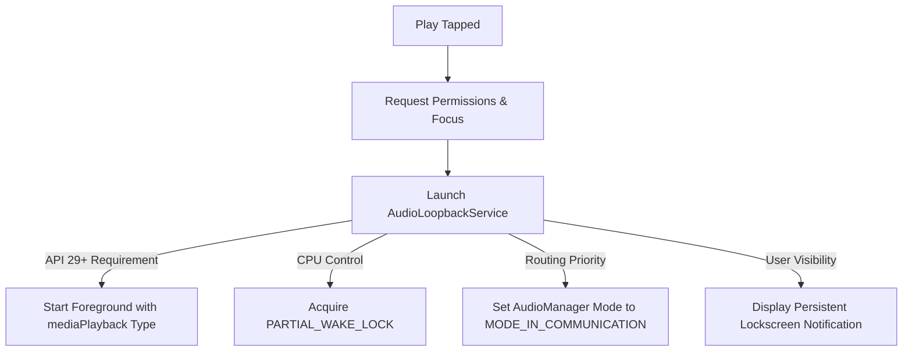

# re:speak — Lock Screen & Background Execution Decisions

This document details the architectural decisions, system restrictions, and strategies for keeping the audio loopback active when the phone is locked, the screen is turned off, or the app is backgrounded.

---

## 1. The Core Challenge

By default, Android's power manager attempts to place the CPU into a deep sleep state ("Doze Mode") when the screen is turned off to maximize battery life. If this occurs during a real-time voice loopback session:
1. The background thread will be suspended, immediately halting the recording/playback loop.
2. If suspended mid-read/write, the buffer queue will stall, causing a loud audio pop or crackle when the device wakes up.
3. The operating system will actively terminate background audio recording to enforce privacy policies.

To prevent this, the application must implement a sequence of system privileges and states.

---

## 2. Technical Decisions & Solutions



### Decision A: Foreground Service (MediaPlayback Type)
* **Choice:** Implement `AudioLoopbackService` as an Android **Foreground Service**.
* **Reasoning:** Since Android 10 (API 29) and Android 14 (API 34), background services are strictly forbidden from recording audio. A Foreground Service with the `mediaPlayback` type is the only standard API allowed to capture mic inputs and play back audio continuously while the app is in the background or the screen is off.
* **Manifest Declaration:**
  ```xml
  <service
      android:name=".service.AudioLoopbackService"
      android:foregroundServiceType="mediaPlayback"
      android:exported="false"/>
  ```

### Decision B: Partial WakeLock Integration
* **Choice:** Acquire a `PARTIAL_WAKE_LOCK` via `PowerManager` for the duration of the active loop.
* **Reasoning:** A foreground service alone does not prevent the CPU from entering low-power Doze states on some devices. A partial wake lock ensures that the CPU keeps running at normal speeds so that audio frames are processed every few milliseconds without stuttering.
* **Rule:** The lock must be acquired **immediately** inside `onStartCommand` when the loop begins and must be released in the `finally` block or inside `onDestroy` to prevent battery draining bugs.

### Decision C: Audio Routing Mode
* **Choice:** Dynamically set `AudioManager.mode = AudioManager.MODE_IN_COMMUNICATION` when starting, and reset to `MODE_NORMAL` on stop.
* **Reasoning:**
  - Tells the Android OS that the app is handling active voice communication, granting higher priority for audio routing.
  - Ensures hardware Acoustic Echo Cancellation (AEC) and Noise Suppression (NS) are correctly initialized.
  - Correctly routes audio to Bluetooth HFP/SCO or wired headsets.

### Decision D: Handling Aggressive OEM Battery Optimization
* **Choice:** Check `PowerManager.isIgnoringBatteryOptimizations()` and show a soft user prompt if the app is optimized.
* **The Problem:** Chinese OEMs (Xiaomi/Redmi, Oppo, Vivo, OnePlus) and Samsung are notorious for killing standard foreground services to force-save battery (often referred to as "Non-Standard Battery Savers").
* **Strategy:**
  1. Detect if the app is currently battery-optimized.
  2. If optimized, display a user-friendly card/dialog explaining: *"To prevent the audio from stopping when your screen is off, please disable battery optimization for re:speak."*
  3. Direct the user to the system battery optimization settings page using `Settings.ACTION_IGNORE_BATTERY_OPTIMIZATION_SETTINGS`.

### Decision E: Dual Theme Support (Light and Dark Mode)
* **Choice:** Support both Light and Dark themes. The Onboarding screen utilizes a clean Light Theme (solid white background `#FFFFFF` with dark teal `#042C34` text/buttons). The Main screen supports dynamic dark/light themes.
* **Transition Flow:** On launch, the Splash Screen (#042C34) displays -> transitions to the Onboarding Screen (Light Theme, #FFFFFF background) -> transitions to the Main Screen.

---

## 3. Lock Screen Lifecycle States

| User Action | System Action | Expected Audio Behavior |
|---|---|---|
| **Screen turns off / Power button pressed** | Display turns off. Activity goes into `onStop` state. Foreground service remains running. | Audio continues playing with zero lag. |
| **Phone locked (Keyguard active)** | Lock screen active. CPU kept awake by `WakeLock`. | Audio continues playing. |
| **User pulls down Notification panel** | Notifications show. Persistent re:speak widget displays timer and "Pause" button. | Audio continues. User can pause directly from the panel. |
| **App swiped away from Recents** | UI process is killed, but Foreground Service binding remains alive. | Audio continues playing; notification remains visible. |

---

## 4. Documentation-Driven Development (Strict Code Lock)

> [!IMPORTANT]
> **Strict Constraint:** Under no circumstances should any code files (Kotlin source files `.kt`, XML layouts `.xml`, Gradle scripts, etc.) be created, modified, or deleted unless the documentation in the `doc/` folder is updated first to reflect the proposed modifications. 
> 
> The documentation serves as the locked blueprint and single source of truth for the codebase. Code changes are strictly derivative of documented agreements.
